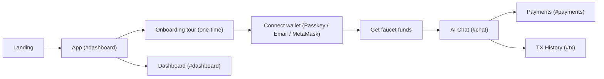
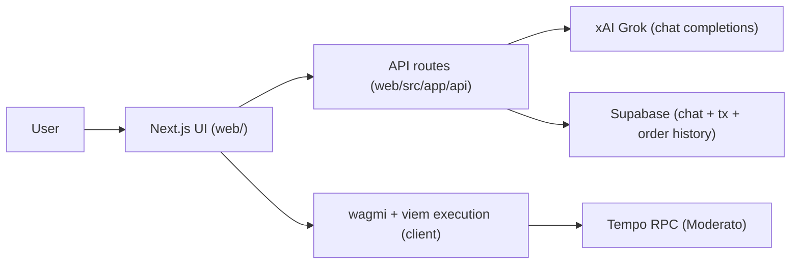
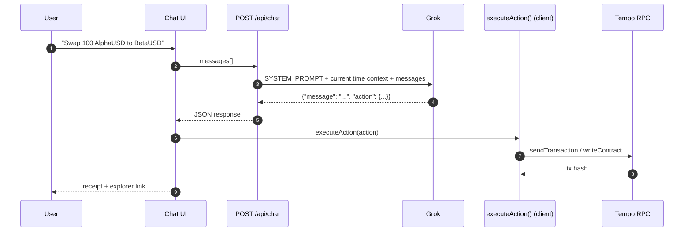
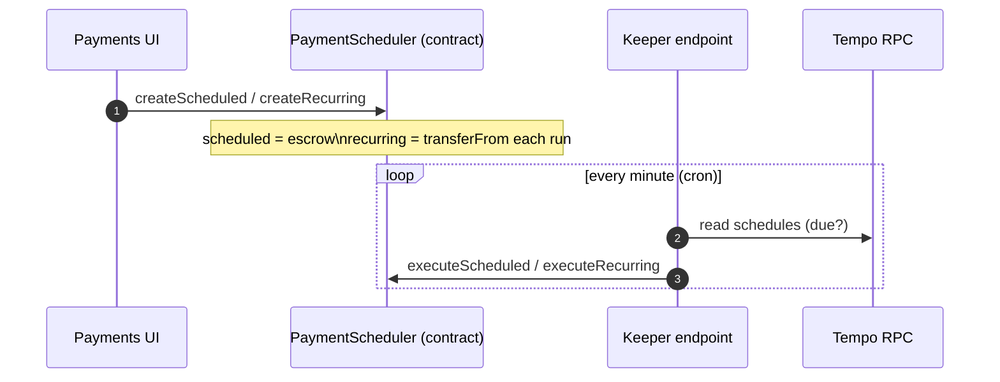
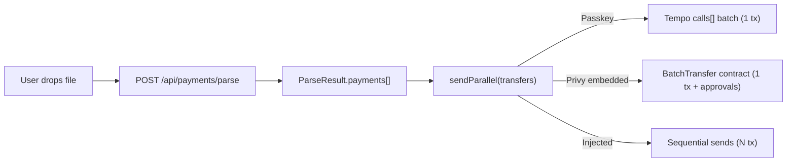

# Sisyphus (Tempo Moderato Testnet)

Sisyphus is a Tempo testnet app that turns plain English into signed on-chain transactions.
The chat is the UI, but the model never gets anywhere near your keys: it returns a strict JSON action, and the browser executes that action through your connected wallet.

## Problem statement

- People jump between multiple UIs for basic tasks (send, swap, orderbook, scheduler, explorer).
- "I'll send this later" or "send this every week" is easy to say, but needs a reliable on-chain + off-chain loop to actually happen.
- Spreadsheet payments turn into click-heavy UX (approve/confirm for every row).
- Wallet onboarding is fragmented. Passkeys, embedded wallets, and injected wallets all behave differently (batch support, nonce handling, approvals).

The practical goal here is boring but useful: one app where you can do the common Tempo flows without context switching.

## What we shipped (solutions)

### 1) Strict actions: the model plans, the client executes

The `/api/chat` route asks the model for a *single JSON object*:

```json
{ "message": "Human response", "action": { "action": "swap", "...": "..." } }
```

Then the client runs `executeAction(...)` to call wagmi/viem and produce a real transaction hash. If the model returns malformed JSON, the API tries to recover by extracting the first JSON object and retries once with a forced "return JSON only" prompt.

Why this matters: the LLM can't "half-execute" anything. No keys on the server. No signing in the model. It can only suggest an action that the client either runs or rejects.

### 2) Wallet-aware execution (batch when possible)

We support three wallet entry points:

- Tempo passkeys (WebAuthn connector): uses Tempo's native `calls[]` batching for multi-send in a single transaction.
- Privy email login (embedded EOA): supports single sends normally; for bulk sends we optionally use a `BatchTransfer` helper contract (single tx after one-time approvals).
- MetaMask/injected wallets: falls back to sequential sends (one tx per transfer).

On top of that we handle the "embedded wallet nonce" problem by taking nonce management out of the provider where needed (`web/src/hooks/use-privy-nonce.ts`).

### 3) Scheduled + recurring payments that actually run

Scheduled payments escrow tokens in the `PaymentScheduler` contract until `executeAt`, and anyone can execute after the due time.
Recurring payments are pull-based: each run does `transferFrom(payer -> recipient)` and advances `nextDueTime`.

To make them fire on time without a human babysitting the app, we expose a keeper endpoint:

- `POST /api/tempo/schedules/execute-due`

That endpoint can be triggered by cron (or any scheduler). It holds a single funded keeper key for gas.

### 4) Drag-and-drop bulk payments from files

The chat accepts file drops (`.csv`, `.txt`, `.xlsx`, `.xls`, `.pdf`) and routes them through:

- `web/src/app/api/payments/parse/route.ts` (extract text/rows)
- `web/src/lib/file-parser.ts` (parse rows into `{address, amount, token}`)
- `useTempoSend().sendParallel(...)` (wallet-aware execution path)

The parser is flexible on CSV headers; it understands column aliases like `address`, `wallet`, `to`, `amount`, `token`.

## User flow



## Supported actions (from chat)

These are the action names the model is allowed to emit (see `web/src/app/api/chat/route.ts`):

- Payments: `send_payment`, `send_parallel`, `schedule_payment`, `recurring_payment`
- Wallet utilities: `get_balance`, `faucet`, `set_fee_token`, `track_token`
- DEX: `swap`, `place_limit_order`, `cancel_order`, `get_open_orders`
- Token ops: `deploy_token`, `mint_token`, `create_pair`, `provide_liquidity`

Old "agent/strategy" actions are hard-blocked client-side in `normalizeAction(...)` so they can't accidentally re-enter the execution path.

## How it works (architecture + flows)

### High-level architecture



### Chat to chain (structured actions)



### Scheduled/recurring payments (keeper loop)



### File upload to batch transfers



## Repository layout (what lives where)

```
.
|-- README.md
|-- package.json                      Root scripts proxy to web/
|-- .env.example                      Example env (safe to commit)
|-- contracts/                        Solidity/Foundry contracts
|   |-- src/
|   |   |-- PaymentScheduler.sol
|   |   `-- BatchTransfer.sol
|   `-- README.md                      Contract build/deploy notes
`-- web/                              Next.js app (UI + API routes)
    |-- next.config.ts                 Next standalone output + bundler fixes
    |-- .env.local.example             Web env template (safe to commit)
    |-- src/app/
    |   |-- page.tsx                   Hash router: #dashboard/#chat/#payments/#tx
    |   |-- landing/page.tsx           Landing page
    |   `-- api/
    |       |-- chat/route.ts          Grok call + strict action prompt
    |       |-- payments/parse/route.ts CSV/XLSX/PDF/TXT parsing
    |       `-- tempo/*                Balance/faucet/orders/schedules/tx endpoints
    |-- src/components/
    |   |-- chat/                      Chat UI + schedule/recurring dialogs
    |   |-- payments/                  Payments view + tables
    |   |-- dashboard/                 Wallet overview + quick actions
    |   |-- onboarding/                One-time guided tour overlay
    |   `-- layout/                    Header/sidebar scaffolding
    |-- src/hooks/                     Wallet + Tempo hooks (send/swap/orders/scheduler)
    |-- src/lib/                       Chain constants, parsing, helpers
    `-- supabase/                      SQL migrations (tables/indexes)
        |-- migrations/
        `-- README.md
```

## Local development

### Requirements

- Node.js 20+
- npm

Optional (contracts): Tempo's Foundry fork (see `contracts/README.md`).

### Run the web app

```bash
cp web/.env.local.example web/.env.local
npm --prefix web ci
npm --prefix web dev
```

Open `http://localhost:3000`.

### Configuration (env vars)

Set these in `web/.env.local`:

- AI
  - `GROK_API_KEY` (required): xAI key used by `/api/chat`
  - `GROK_MODEL` (optional): default `grok-4-1-fast-non-reasoning`
- Wallet / auth
  - `NEXT_PUBLIC_PRIVY_APP_ID` (required): Privy app id (email login / embedded wallet)
- RPC
  - `TEMPO_RPC_URL` (optional): overrides Moderato RPC
- Bulk send (Privy embedded only)
  - `NEXT_PUBLIC_BATCH_TRANSFER_ADDRESS` (optional): enable 1-tx bulk sends via `BatchTransfer`
- Keeper (scheduled/recurring execution)
  - `KEEPER_PRIVATE_KEY` (required only if you run the keeper): funded key used by `/api/tempo/schedules/execute-due`
  - `CRON_SECRET` (optional): bearer token to protect keeper endpoint
- Routing
  - `NEXT_PUBLIC_APP_URL` (optional): enables host split between landing and app
- Supabase (required for chat sessions + tx/order history)
  - `NEXT_PUBLIC_SUPABASE_URL`
  - `NEXT_PUBLIC_SUPABASE_ANON_KEY`

There's also a root `.env.example` if you prefer keeping runtime vars outside `web/`.

## Supabase schema

Supabase stores:

- `chat_sessions` (one row per conversation, per wallet)
- `chat_messages` (messages, scoped by `session_id`)
- `transactions` (tx history)
- `limit_orders` (local index of on-chain order IDs for nicer UX)

Migrations live in `web/supabase/migrations/`. See `web/supabase/README.md`.

## Contracts

Contracts live in `contracts/`:

- `PaymentScheduler.sol`: one-time escrow schedules + recurring pull schedules
- `BatchTransfer.sol`: single-tx multi-transfer helper for embedded EOAs

Build/deploy steps are in `contracts/README.md`.

## Security notes

- Secrets are not committed: `.env*`, `*.pem`, and key files are ignored by default.
- `NEXT_PUBLIC_*` env vars are visible in the browser. Keep them public.
- `KEEPER_PRIVATE_KEY` is server-side only and must be funded for gas if you run the keeper endpoint.
